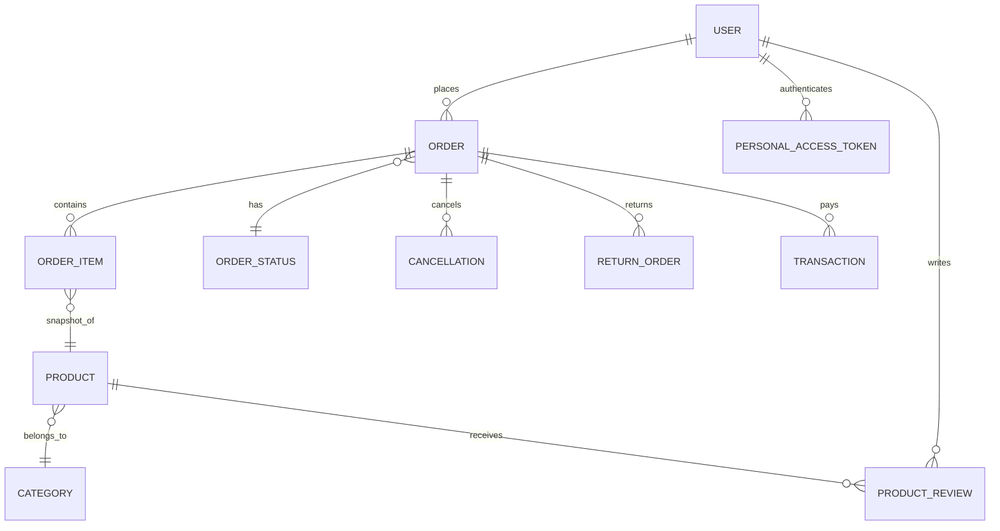
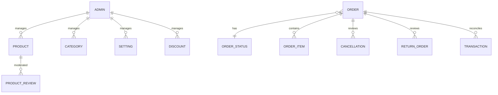

# Conceptual Database Design — Ecommerce App

Scope: desain konseptual berdasarkan domain aplikasi, dipisah untuk User (customer-facing) dan Admin (backoffice). Tidak termasuk tabel/layanan shipping (provinsi/kabupaten/kecamatan). Nomor resi disimpan di tabel orders.

## User Domain (Customer-Facing)

### Entitas Utama
- User
  - Atribut kunci: id, name, email, password, email_verified_at
  - Autentikasi: personal access tokens (Sanctum), sessions
- Product
  - Atribut kunci: id, name, description, price, stock, images, variants
- Category
  - Atribut kunci: id, name, slug
- Order
  - Atribut kunci: id, user_id, total, order_date, status_id, stock_deducted_at (nullable)
  - Pengiriman: tracking_number (nullable)
  - Informasi pembeli: buyer_name, buyer_phone, buyer_address
- OrderItem
  - Atribut kunci: id, order_id, product_id (opsional), product_name, product_image, variant (nullable), price, quantity
- OrderStatus
  - Atribut kunci: id, name, description
- Transaction (Midtrans)
  - Atribut kunci: id, order_id (string unik, business code), amount, status, snap_token
- Discount
  - Atribut kunci: id, code (unique), description, amount, start_date, end_date
- Cancellation
  - Atribut kunci: id, order_id, reason, cancellation_date, initiator, decision
- ReturnOrder
  - Atribut kunci: id, order_id, reason, return_date, photo_path, video_path, decision
- Setting (konten publik)
  - Atribut kunci: id, terms_conditions, contact_help, company_profile
- ProductReview
  - Atribut kunci: id, product_id, user_id (nullable), author (nullable), rating, text, created_at

### Relasi & Kardinalitas
- User 1..N Order — seorang user dapat membuat banyak pesanan.
- Order 1..N OrderItem — sebuah pesanan mengandung banyak item.
- Order N..1 OrderStatus — setiap pesanan memiliki satu status aktif saat ini.
- Order 0..N Cancellation — pembatalan dapat diajukan (initiator: buyer/seller), bisa lebih dari sekali.
- Order 0..N ReturnOrder — pengembalian/refund dapat terjadi lebih dari sekali per order.
- Order 0..1 Transaction — satu transaksi pembayaran aktif per order (konseptual); retry bisa tercatat sebagai pembaruan status.
- Product N..1 Category — produk berada pada satu kategori; secara konseptual gunakan `category_id`.
- OrderItem N..1 Product — referensi ke produk opsional; data item disimpan sebagai snapshot (nama, gambar, harga) untuk menjaga riwayat.
- User 1..N ProductReview — user dapat menulis banyak ulasan.
- Product 1..N ProductReview — satu produk memiliki banyak ulasan.

### Catatan Konseptual
- Category: pada implementasi saat ini `products.category` adalah string; secara konseptual disarankan normalisasi menjadi `category_id` (FK ke `categories.id`).
- Discount: secara konseptual bisa dihubungkan ke Order (0..1) atau ke Product (0..N) jika ada promo per-produk; implementasi saat ini berdiri sendiri.
- Transaction: `order_id` adalah business code (string) untuk Midtrans; konseptualnya juga baik memiliki FK numeric `order_numeric_id` ke `orders.id` untuk integritas internal.

### ERD (Konseptual, User Domain)

## Admin Domain (Backoffice)

### Entitas Utama
- Admin
  - Atribut kunci: id, name, username (unique), email (unique), password, email_verified_at
  - Autentikasi: personal access tokens, sessions
- Product, Category, Setting, Discount — sama seperti User domain, namun dengan hak kelola.
- Order, OrderItem, OrderStatus — admin memonitor, memperbarui status.
- Cancellation — admin menilai alasan, menetapkan `decision` (approved/rejected/pending).
- ReturnOrder — admin memverifikasi bukti (photo/video), menetapkan `decision`.
- Transaction — admin memantau status pembayaran, rekonsiliasi.
- ProductReview — admin memantau/memoderasi ulasan (hapus/takedown bila perlu).

### Relasi & Kardinalitas (Kontrol Admin)
- Admin 1..N Product (manage) — admin dapat membuat/mengubah produk.
- Admin 1..N Category (manage) — admin kelola kategori.
- Admin 1..N Setting (manage) — admin kelola konten publik.
- Admin 1..N Discount (manage) — admin kelola kode diskon.
- Admin mengubah OrderStatus — perubahan status pesanan dicatat pada `orders.status_id`.
- Admin meninjau Cancellation/ReturnOrder — menetapkan `decision` sesuai kebijakan.
- Admin memantau Transaction — tidak mengubah data token, namun mengelola proses menggunakan Midtrans.

### ERD (Konseptual, Admin Domain)

## Batasan & Non-Goals
- Shipping tidak termasuk: provinsi/kabupaten/kecamatan/ongkir dikelola via API eksternal, tidak ada tabel DB lokal dalam scope desain ini.
- Cart tidak dimodelkan di DB saat ini: jika diperlukan, tambahkan entitas `cart` dan `cart_item` dengan relasi ke `users` dan `products`.

## Rekomendasi Konseptual ke Implementasi
- Normalisasi kategori: `products.category_id` (FK) menggantikan string `category`.
- Tambah `transactions.order_numeric_id` (FK ke `orders.id`) untuk integritas, tetap menyimpan `order_id` (string) untuk Midtrans.
- Opsional: tambahkan `order_discounts` untuk mengikat diskon ke pesanan, dengan audit (siapa yang menerapkan, kapan).
- Opsional: log status pesanan (status history) agar jejak perubahan dapat diaudit.

---
Dokumen ini melengkapi logical design di `docs/db/logical_design.md` dengan fokus pada konsep domain, entitas, dan relasi antar entitas untuk User vs Admin.